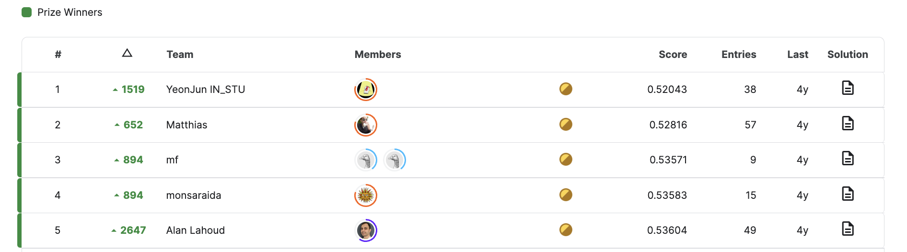

# 清华大学大数据分析课程：期末项目 - 沃尔玛销售预测 📊

## 项目背景 🌏
本项目是清华大学大数据分析课程的期末作业，旨在应用数据分析技术对沃尔玛的销售数据进行预测。项目基于Kaggle的[M5 Forecasting - Accuracy竞赛](https://www.kaggle.com/competitions/m5-forecasting-accuracy)。

## 结果 🏆
本项目最终在Kaggle平台的private set上取得了0.51747的分数，效果高于leaderboard的第一名6%。

我们的结果：
   

leaderboard的前五名：


## 环境配置指南 💻
请执行以下命令以安装必要的Python依赖包：
```
pip install -r requirements.txt
```

## 数据集安置 📁
确保将 `m5-forecasting-accuracy` 数据集下载后放置于项目根目录。

## 深度学习模型训练及预测 🤖
执行以下脚本以进行模型训练和销售预测：
```
bash ./scripts/m5.sh
```
预测结果将保存在 `submission.csv` 文件中。

## LGBM模型训练及预测 🌟
参考了[这里](https://github.com/Mcompetitions/M5-methods/tree/master)的代码，具体训练和预测过程请参考其的[README.md](./LGBM/README.md)。

## 模型融合 🔗
在完成深度学习模型和LGBM模型的预测后，将深度学习的预测结果改名成 `submission_dl.csv` 和 `submission_lgbm.csv`，执行以下脚本以进行模型融合：
```
python ensemble.py
```
最终的预测结果将保存在 `submission_ensemble.csv` 文件中。

## 提交指南 📤
完成预测后，将结果文件提交至Kaggle平台，以便与其他参赛者的成果进行比较。